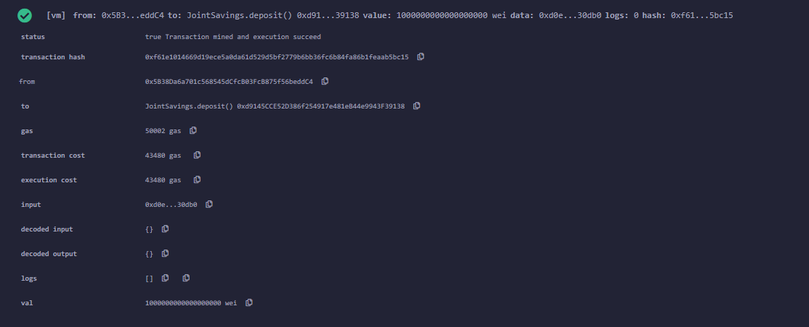
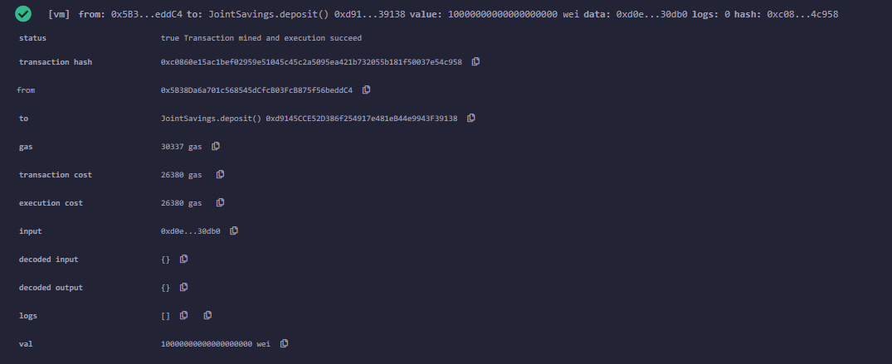
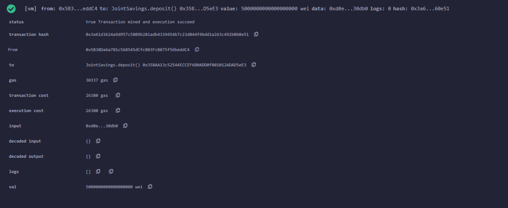
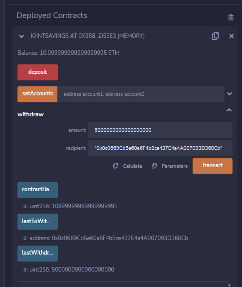
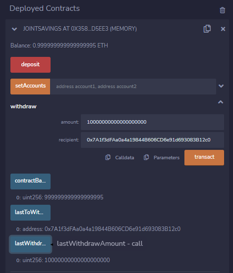

# Challenge 20 Joint Savings Solidity

##  Introduction
Create an interative joint savings account using Solidity smart contracts and the Ethereum Blockchain.

## Technology
- Solidity
- https://remix.ethereum.org/

## Demonstration
Transaction 1: Send 1 ether as wei.

Transcation 2: Send 10 ether as wei.

Transaction 3: Send 5 ether.

Withdraw 5 ether into account 1.

Withdraw 10 ether into account 2.

## Contributors

Created by Ryan Granston
> Contact Info:
> email: ryan.granston@gmail.com|
> 
> [GitHub] (https://github.com/RGranston) |